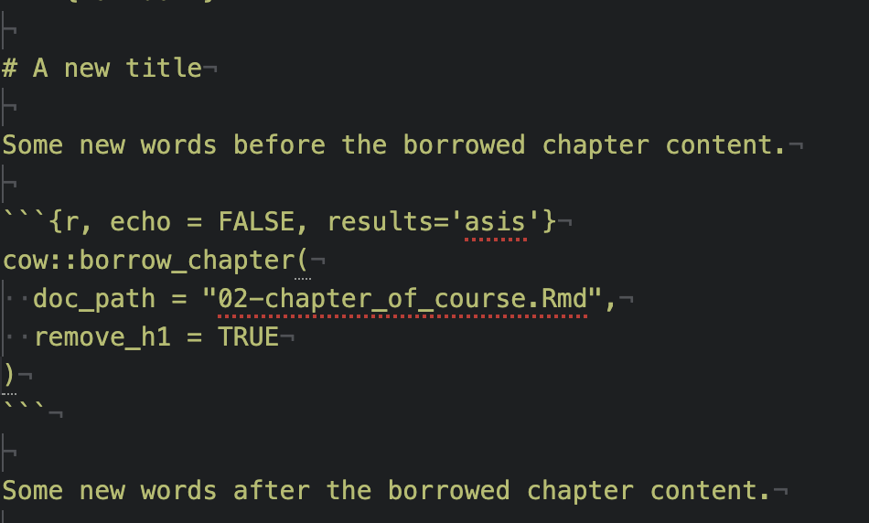
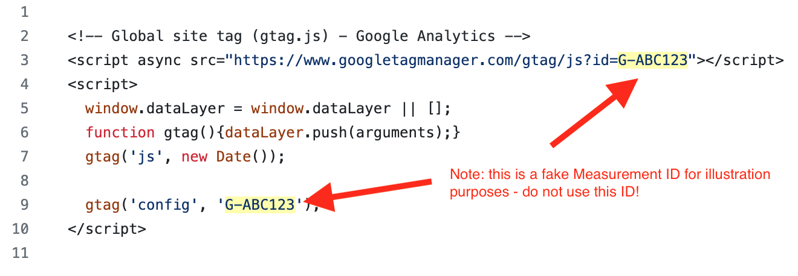
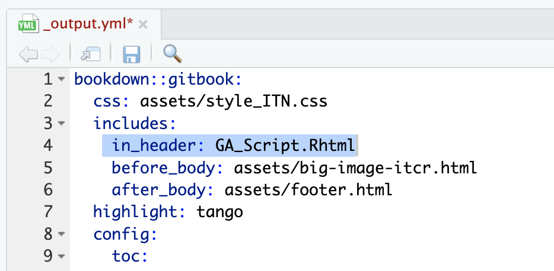

There are a lot of additional features and tools of OTTR that are discussed here!

## Citing sources

You can generally follow the [Bookdown instructions about citations](https://bookdown.org/yihui/rmarkdown-cookbook/bibliography.html), but you don't need to add the additional bibliography argument at the top of the Rmd.

To add a new reference source, add to the `book.bib` file, keeping your new entry in alphabetical order.

For articles (or anything with a DOI), go to [doi2bib.org](https://www.doi2bib.org/) or [ZoteroBib](https://zbib.org/) to get a BibTex-formatted reference that you can copy and paste the reference to the `book.bib` file.

You can also use programs like Zotero or Endnote to export a .bib file and either combine with the `book.bib` or manage your references from there.

Other sources can be added using this template:
```
@website{citekey,
    author = {First Last},
    title = {Title},
    url  = {www.website.com},
}
```

To reference the citations in your writing follow the [bookdown instructions](https://bookdown.org/yihui/rmarkdown-cookbook/bibliography.html):

> Items can be cited directly within the documentation using the syntax @key where key is the citation key in the first line of the entry, e.g., @R-base. To put citations in parentheses, use [@key]. To cite multiple entries, separate the keys by semicolons, e.g., [@key-1; @key-2; @key-3]. To suppress the mention of the author, add a minus sign before @, e.g., [-@R-base].


See [Chapter 2](https://github.com/jhudsl/OTTR_Template/blob/main/02-chapter_of_course.Rmd) of this template course for examples.

This will automatically list references at the bottom of each chapter included in your course, as well as at the end of your course. Thus it is important to keep the `References.Rmd` file and to keep this as the last part of the `_bookdown.yml` file as it is in the template, so that this full list of references will be listed in a place that makes sense.


Alternatively, you can add a header for this list of references as the last header in any other Rmd file that is listed as the final file of the `_bookdown.yml` file.

If you would like to suppress having references listed at the end of each chapter, you can add a line that says `split_bib: false`  to your `_output.yml` file.


<br>

## Giving credits to contributors

Since so many individuals contribute to our courses in so many ways, we decided to make a table of credits to make it clear who did what.

Here is an example:  


Please see the [About section](https://jhudatascience.org/OTTR_Template/about-the-authors.html) of the template for descriptions of how credits should be attributed for the course.

This is generated from the About.Rmd file. An About.Rmd file will already be in your course from using our template. You will need to do the following steps to update it for your course:

1) Fill out author names for the various roles where applicable.  
2) Delete lines for roles that are not applicable.  
3) Make sure roles grammatically match names. If there are multiple people include the "s" in the role name where applicable and remove the parentheses. If only one person is appropriate for a given role remove "(s)" from the role name.
4) Ensure that each row has "|" around each cell value.  

*Example Table*:

The first row and additional rows based on [this table](https://bit.ly/course-credits-table) should be added and filled in using [Markdown table format](https://www.markdownguide.org/extended-syntax/).
```
|Credits|Names|
|-------|-----|
|Lead Content Instructor|FirstName LastName|
```

Links to personal websites can be added below the table to make it easier to read.
```
|Credits|Names|
|-------|-----|
|Lead Content Instructor|[FirstName LastName]|

<!-- Author information -->

[FirstName LastName]: link to personal website
```

These rows should be included for _all courses_:
```
|Template Publishing Engineers|[Candace Savonen], [Carrie Wright]|
|Publishing Maintenance Engineer|[Candace Savonen]|
|Technical Publishing Stylists|[Carrie Wright], [Candace Savonen]|
|Package Developers[ottrpal]|[John Muschelli], [Candace Savonen], [Carrie Wright]|

<!-- Author information -->

[John Muschelli]: https://johnmuschelli.com/
[Candace Savonen]: https://www.cansavvy.com/
[Carrie Wright]: https://carriewright11.github.io/

<!-- Links -->

[ottrpal]: https://github.com/jhudsl/ottrpal
```

These rows should be added to all _Johns Hopkins_ courses:
```
|Content Publisher|[Ira Gooding]|
|Content Publishing Reviewer|Ira Gooding]|

<!-- Author information -->

[Ira Gooding]: https://publichealth.jhu.edu/faculty/4130/ira-gooding
```

Additionally, this row should be added for _all ITCR Courses_:  
```
|Content Directors|[Jeff Leek]|

<!-- Author information -->

[Jeff Leek]: https://jtleek.com/
```


### Adding the Credits table to Coursera

In Coursera, you can add the credits table URL as an ungraded plugin ([the same as described here for adding chapter content](https://github.com/jhudsl/OTTR_Template/wiki/Publishing-on-Coursera#navigating-to-your-course-on-coursera)). This should be added at the beginning of your course, right after the introduction.

### Adding the Credits table to Leanpub

In Leanpub, make sure that your About.md file in your manuscript folder is listed in your Book.txt file and this Credits table will automatically be incorporated into your Leanpub course.

<br>

## Borrowing Chapters

If you have two courses where the content and topics overlap, you may want to share written material between the two.

However, sharing material by copying and pasting can lead to maintenance issues, as updating one would require remembering to update the other as well! 😱

In OTTR, we try to minimize maintenance pains. To get around this, we use `cow::borrow_chapter()` from the [jhudsl/cow](https://jhudatascience.org/cow/index.html) package.
The `cow` package is already on the `jhudsl/course_template` Docker image  so you do not need to install it if you are using the Docker image or if you are have GitHub Actions do all the rendering for you.

To borrow a chapter from another course, create an `.Rmd` as you normally would, with a `ottrpal::set_knitr_image_path()` in a chunk at the beginning of the file and a [`H1` title](https://www.markdownguide.org/basic-syntax/).

Then, wherever you would like the borrowed chapter to appear, put an R chunk with this; where `{r, echo = FALSE, results='asis'}` is included in your chunk arguments.

```
cow::borrow_chapter(
  doc_path = "02-chapter_of_course.Rmd",
  repo_name = "jhudsl/OTTR_Template"
)
```

The magic of this function is that whenever the course is re-rendered it will knit the latest version of the chapter you are borrowing.
Note that this chunk cannot be run interactively, just include it in your Rmd and render your course as usual.

### Borrowing from a local file

If for some reason you would like a local file incorporated, just leave off the `repo_name` argument and `cow::borrow_chapter()` will look for the chapter locally.

Have your chunk arguments include `{r, echo = FALSE, results='asis'}`.
```
cow::borrow_chapter(
  doc_path = "02-chapter_of_course.Rmd"
)
```

### Borrowing from a private repository

If you are borrowing from a course in a private repository, you will need to supply a [GitHub personal access token](https://docs.github.com/en/authentication/keeping-your-account-and-data-secure/creating-a-personal-access-token) using a `git_pat` argument like this:

Have your chunk arguments include:`{r, echo = FALSE, results='asis'}`

```
cow::borrow_chapter(
  doc_path = "02-chapter_of_course.Rmd",
  repo_name = "jhudsl/Private_Repo",
  git_pat = "12345"
)
```

### Removing an h1 header

If you want to change the title you can use an option `remove_h1` to remove the title from the incoming borrowed chapter.



### Linking between chapters

If you don't want the material from another chapter completely copied over, you might instead just want to put a link to the Bookdown chapter. You can just use the full URL. A link would look something like this:
```

```


You might want your course available for download as a docx. For example, you might be running a "train-the-trainer" workshop where trainees don't feel comfortable using Github to edit the lessons for their own use.

The following yml in `index.Rmd` allows you to render the docx with a table of contents:

```
output:
    bookdown::word_document2:
      toc: true
```

You can also incorporate a template docx if you have headers and logos you want to use. To incorporate a template, make sure you add the `reference_docx` argument:

```
output:
    bookdown::word_document2:
      reference_docx: <path/to/template>.docx
      toc: true
```

Learn more about templates [here](https://bookdown.org/yihui/rmarkdown-cookbook/word-template.html).


<br>


## Compatibility with Google Docs

Google Docs can be a great way to get feedback from collaborators who aren't comfortable developing in the GitHub environment. docx versions of the course are automatically rendered in pull requests and can be downloaded from the autogenerated comment.

- Once you've downloaded the docx, this can be uploaded to Google Drive and shared with the individuals you would like to solicit feedback or new material from. In Google Drive, click `+ New` in the left corner and then `File Upload`. Choose the docx file you downloaded.
- You may also want to include a link to the commit ID the Google Doc came from so you are able to keep track of what changes have occurred since the Google doc was set up initially.
- So you are able to keep track of the changes to the docx version of the course, its advisable to set to "suggestions" when you share the document.
- Then as comments and suggestions trickle in, a lead author who is comfortable with the OTTR process can incorporate those comments into an existing or new pull request which can checked for its rendering and eventually added to the `main` content branch.

<br>

## Google Analytics

If you would like to add Google Analytics to track traffic to your course, you can do the following:

1. Get a **Google Analytics account** (if you do not already have one): [https://analytics.google.com/analytics](https://analytics.google.com/analytics)

Note that in creating an account you will need to agree to some terms. Currently it is free to get Google analytics data as long as your course does not exceed a very high user rate.

Check to make sure that the terms work for you


1. If you already have an account or navigated away from where you started - Go to the **Admin tab** (lower left button that looks like a gear)

1. Set up a new **property** (fill out name and details, select options about tracking traffic for how you intend to use Google Analytics)


1. Add a **stream** to your property, choose the **Web** option.


1. Fill in your stream information with the **link** for your course (note you may need to remove https as this is part of a pull down menu to the left of where you paste your link)


1. On the resulting page you will see a **Measurement ID**. Copy this ID and paste it in the GA_Script.html file in the template replacing the fields that say {MeasurementID} including the curly brackets.  For example, if your ID was `G-ABC123`, then the line `gtag('config', '{MeasurementID}');` would become `gtag('config', 'G-ABC123');`.



1. Add a line to the _output.yml file above the line that starts with `before body:` (i.e. nested under `includes`).  This line should be `in_header: GA_Script.html`.  Make sure this line is indented to the same level as the `before body:` line.


1. **Rerender** your course by making a change to one of your chapter RMD files in a pull request and pushing and merging the pull request. This will cause new html files to be made for each chapter in the `docs` folder. The Google Analytics code should now be in each of the html files - you can check by searching for `Google Analytics`.

1. Go back to [Google Analytics](https://analytics.google.com/analytics) and log in if you need to.

1. Check on the **Reports** button on the top of the far left icon menu. The icon looks like a bar chart. If you open up a browser window to your hosted course online, then you should see yourself as 1 user in the last 30 minutes.


1. Enjoy the data about how people are using your course!
