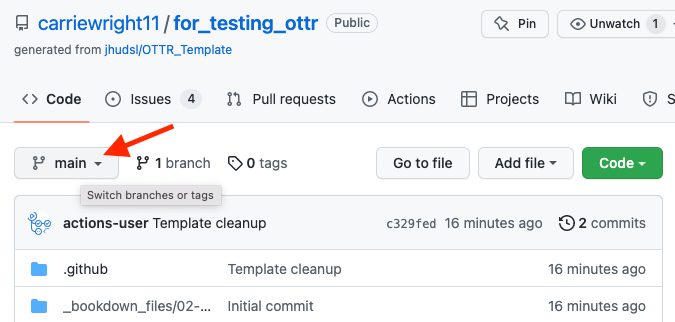
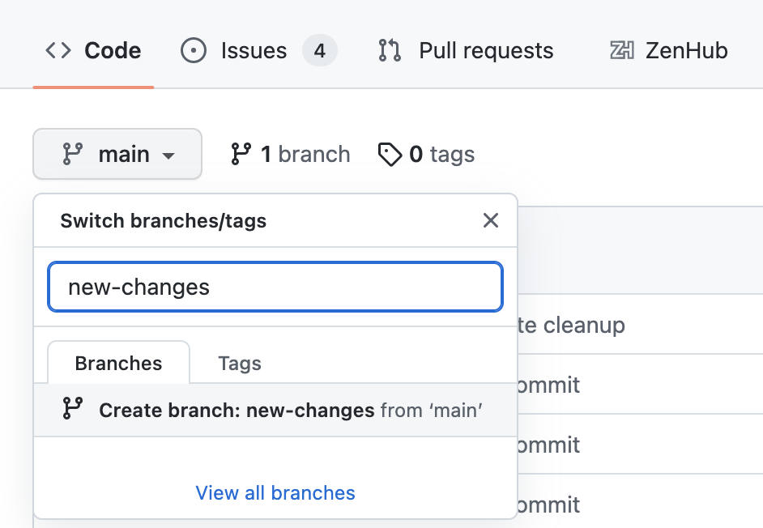
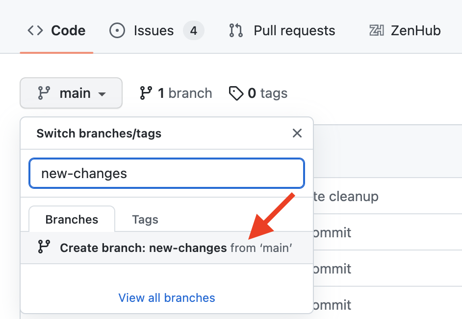
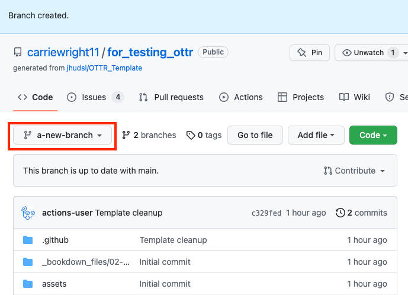
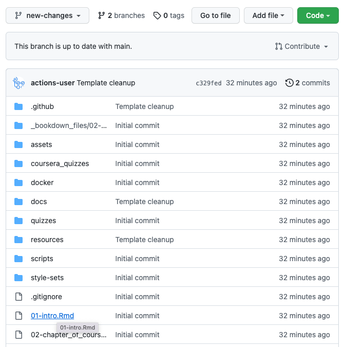
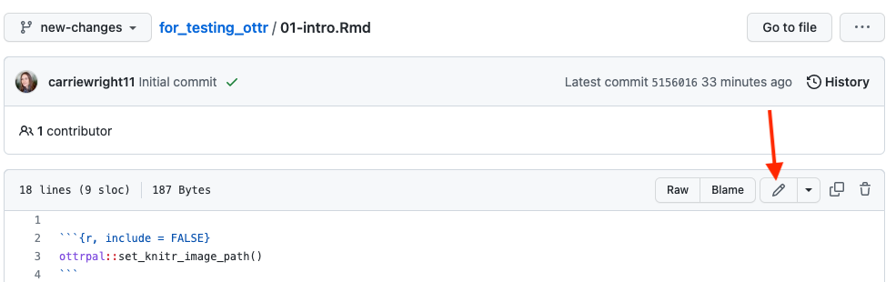
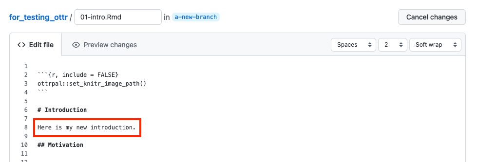
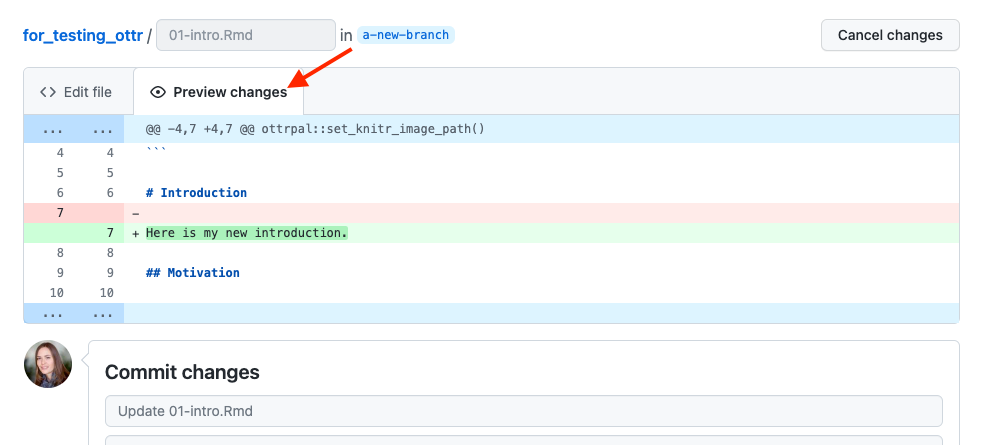
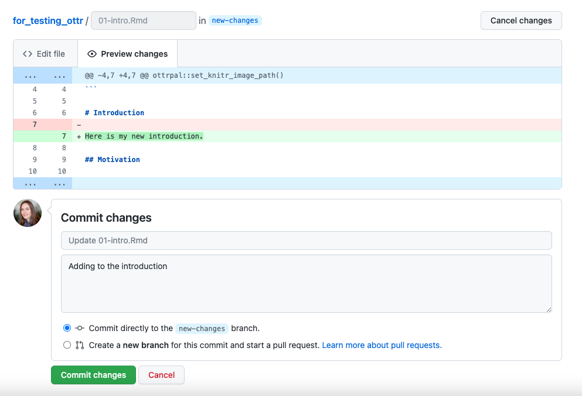
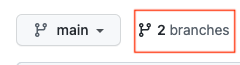

Now you have a course repository on GitHub and you're ready to start writing content!

The OTTR content development process revolves around the use of 
**pull requests**! Pull requests are a way to set up
**proposed changes** (instead of direct changes) before you publish
them. They enable OTTR to test your proposed changes for
potential issues such as broken URLs or spelling errors. Importantly, pull requests
facilitate discussions with others regarding proposed changes.


## Method of writing content

We have two recommended ways of writing content that is based on your
comfort and interest level in using Git and GitHub:

- [OTTR Entry Level](https://www.ottrproject.org/writing_content.html#ottr-entry-level): If you are not interested in delving into GitHub, you can use this version, which is entirely conducted through the GitHub web browser.
- [OTTR Advanced](https://www.ottrproject.org/writing_content.html#ottr-advanced):  If you are already familiar with Git and GitHub or have an interest in starting to use them, we suggest this method. It will involve some additional learning, but acquiring skills in Git and GitHub will be highly beneficial not only for OTTR but also for version control in various other contexts.


OTTR's checks primarily focus on pull requests so you can avoid accidentally making your mistakes in your live courses.

The live content is automatically created and stored in the `docs` folder. As our writing process guide will inform you, you should NOT make direct changes to the `docs` folder. The automation processes will handle the preparation of these files, and you should refrain from making direct changes to them. To learn how to edit your files and write your course, please review the corresponding section in the writing process guide.

When you submit a pull request, it triggers a sequence of automatic checks performed by GitHub Actions. These checks are designed to assist you as you add content to your course.

These checks will:  

* Check that the all the URLs actually take learners somewhere (`check-urls`)
* Check that the code is styled using the `styler` package (`style-and-sp-check`)
* Check that the spelling is correct using the `spelling` package (`style-and-sp-check`)
* Create previews of the rendered versions of the course (`render-preview`)
* Check the formatting of any quizzes (`check-quizzes`)

You can adjust what checks are run by editing the
`config_automation.yml` file. This is further discussed in this section
about [customizing GitHub Actions](./customize-robots.html).

-   [Jump to OTTR Entry Level instructions](#ottr-entry-level)\
-   [Jump to OTTR Advanced instructions](#ottr-advanced)

<br>

# OTTR Entry Level {#ottr-entry-level}

You can edit and add content directly in the GitHub website if you
prefer not to learn Git and GitHub (though we highly recommend it, as
knowing how to use Git/GitHub is a useful skill to integrate into your
workflow -- not just for OTTR).

## Create a new branch

With GitHub in order to keep your OTTR course preserved content and code
is managed through the use of branches. To explain branches we'll mainly
refer to two branches: your `main` branch:


The `main` branch is what your content will be published from and it
will be live to any learners looking at your course. You will want to
keep this `main` branch as preserved and well curated as possible!

So when you are ready to add more content you will want to have an
isolated copy of your files to work from that keeps your main branch
safe as you work. You can name the branch you work from whatever you
like -- its recommended you name it something related to the changes you
are working on


To create a new branch through the GitHub website, you will go to your
main course repository page, click on the branch changing button that
says `main`.



Type in a name for your new branch; something that relates to the
changes you are making. For the purposes of this example, we'll call
this new branch, `a-new-branch`.



Then click `Create branch: new-changes from main`.



Congrats! You've made a new branch. GitHub will automatically show you
your new branch's files (which have been copied from the `main`).

You can tell that you are on the new branch as the left corner branch
tab now says the name of our new branch (`a-new-branch`).



Now that we have a copy of all the files from the `main` branch, we can
safely work on them in the `a-new-branch` branch.


Whenever you are making changes, you'll want to check that you are on
your new branch in order to add any new changes to your pull request,
just look at the left upper corner to make sure!

Now let's try making some changes.


## Committing changes

In your OTTR repository, on your new branch, you can now add/edit/rename
currently existing files while protecting your `main` branch. Adding
changes to a branch is called making `commits`.

We will describe how to edit existing files below, however, GitHub has
great information about how to create and remove files. Additionally
GitHub is always making changes, so if our instructions seem out of date,
definitely checkout GitHub's current documentation:

-   [Follow GitHub's instructions about managing files through their
    website
    here](https://docs.github.com/en/repositories/working-with-files/managing-files).

After every edit you make, scroll down and make sure that you choose
`Commit directly to the new-changes branch.`. This will add your changes
to the pull request and thus allowing for these changes to be run
through the OTTR checks.

Then click `Commit changes`. You will need to do this after every change
to add them to your branch.

As an example, we will show a simple change to the file called
`01-intro.Rmd`. Scroll down to the this file and click on this file
name.



Now click on the edit button to make a change. Notice that it shows what branch we are working on.



Make an edit, such as adding to the introduction like so.



You can preview how it looks by pressing the `Preview changes` button.
Red will indicate new deletions and green will indicate new additions.



Then write a message about what changes you made and press the
`commit changes` button.



Now you are ready to open your pull request.

-   [Jump to section titled 'Open a Pull Request'](#open-a-pull-request)

<br>

# OTTR Advanced {#ottr-advanced}

If you have an interest in utilizing GitHub (or already possess knowledge in this area), we suggest engaging with GitHub and Git beyond the GitHub website for creating your pull requests.

If you are new to Git and GitHub, it is recommended you use a Git client
to help you manage your branches more easily. Install
[GitKraken](https://www.gitkraken.com/) for a handy way to manage your
course locally. These steps shown here will show you the GitKraken way
of handling files.

If you are not new to GitHub, then we recommend skipping this section
and jumping to the [`Setting Up Images` section](#set-up-images).

## Cloning with Git

In the GitHub workflow (excluding the Entry-Level writing method), files exist online (remote) and on your computer (local).


You will need to `clone` the course repository to your own
computer. Having a local copy of the files you are working from makes it
easier to work from. Cloning is just making a local copy on your
computer of the remote version of the project on GitHub.


To get started, you will need to clone your course's repository that you
created, as you will be using it for the duration of writing your
course.

To clone a GitHub repository, using GitKraken, first, click
`Clone a repo`. Then, choose where you'd like the repository to be on
your computer using the `Browse` button. You will need to `Copy + Paste`
your new repository's url to where it says `URL`.


Navigate to your repository on GitHub to copy the URL. Copying and
pasting is advisable because any little typo will inhibit cloning.

Now you are ready to click `Clone the repository`! It will ask you if
you'd like to `Open Now`, click that.


## Create a new branch

Handling branches is where you unleash the real benefit of GitHub, but
it can be confusing at first.

In GitHub, preserving the content and code of your OTTR course is accomplished through the utilization of branches.

To explain branches we'll mainly refer to two branches: your `main`
branch:


The `main` branch is what your content will be published from and it
will be live to any learners looking at your course. You will want to
keep this `main` branch as preserved and well curated as possible!

So when you are ready to add more content you will want to have an
isolated copy of your files to work from that keeps your main branch
safe as you work. You can name the branch you work from whatever you
like -- its recommended you name it something related to the changes you
are working on

The best way to get a grasp of what the branches represent is to create
one and start using it.


In GitKraken we can create a new branch; this will be your working copy.
First, click the `Branch` button. Next, type in a branch name in the box
that the cursor is blinking in. In our example, we are calling it
`a-new-branch`. Now click `Enter`! Now you have a new branch!


Now we can add/edit/rename currently existing files in our new branch,
knowing that the content and code in the `main` branch is safe.


## Committing changes

Adding changes to a branch is called making `commits`. To modify any
files in a branch we have to first 1) Make our changes as we normally
would and then 2) Commit those changes.

To commit changes, begin by editing a file using your preferred text editor. You can simply double-click a file locally to open it. For this example, the specific change you make doesn't matter much; it can be a small modification that you will easily notice later.


If you've made a change to any file in your repository, it will appear
in GitKraken and you can click on it to see the differences.


If we want to add these file changes to our current branch, we need to
`commit` them.


Great! Now the changes you've made have been added to your local branch.


## Pushing changes

Note that when you've committed your changes locally, those changes
won't be on the online version of your repository. To get them to the
remote GitHub copy, we will need to `push` your commits.

Now that we have changes committed to our branch we are ready to also
add them to the remote GitHub copy!


To **push** means to add changes that are on your new branch to the
remote branch (internet version on GitHub). The word **origin** just
refers to where your branch is stored on the internet. Choose your
origin in the dropdown menu and click `Submit`.


<br>

# Open a pull request {#open-a-pull-request}

After a variable number of commits, your branch, perhaps called
`a-new-branch` or any other new branch you might have made, is a
different version of the original code base that may have a nifty
improvement to it. But our main goal is to add that nifty improvement to
the `main` branch. To start this process of bringing in new changes to
the main curated repository, we will create a **pull request**.

From GitHub:

> Pull requests let you tell others about changes you've pushed to a
> GitHub repository. Once a pull request is sent, interested parties can
> review the set of changes, discuss potential modifications, and even
> push follow-up commits if necessary.

Pull requests are the meat of how code changes and improvements get
reviewed and incorporated! A vast majority of the benefits of
incorporating GitHub into your workflow centers around fully utilizing
the power of pull requests!


Now we can open up a pull request if we go to our GitHub repository on
GitHub. You might need to migrate back to the main page for your
repository and can do so by simply clicking on the blue name of your
repository at the top. Then you will see something like this yellow
banner message, where there is a button that says
`Compare & pull request`.


<details>

<summary>Click here if you don't see the pull request message!!!</summary>

Note that sometimes if you have used the same branch multiple times you
may need some extra steps to create a pull request. This will involve
first clicking on the branch tab (which may have a different number).



Then click on the `New Pull Request` button for the branch you want to
work on. Be careful that is the branch you intend.


</details>

<br>

After you click on `Compare & pull request` you'll be taken to a screen
where you can add information about your changes. After you are done
writing your description, click `Create Pull Request`! (If you don't
have your pull request description *perfect* don't worry about it, you
can always edit it later).

Congrats! You've just opened a pull request! For every set of changes
you'll make to your course, you will want to follow this similar set of
steps.

**In summary, here are the steps invovled:**


<br>


# Checks on the pull requests

Once your pull request is open, the OTTR GitHub Actions checks will begin. These checks will generate reports as comments on your pull request.


Read these comments to begin addressing the problems with more commits
to your branch.

You can adjust what checks are run by editing the
`config_automation.yml` file. This is further discussed in this section
about [the GitHub
Actions](https://github.com/jhudsl/OTTR_Template/wiki/How-to-set-up-and-customize-GitHub-actions-robots).

If you need more information on failed GitHub actions you can scroll to
the bottom of your pull request where the status of the checks are shown
and click on `Details` for more information. If you are unsure what the
error message means and have trouble addressing it, please [file an
issue on the OTTR_Template repository to get
help](https://github.com/jhudsl/OTTR_Template/issues/new?assignees=cansavvy&labels=bug&template=course-template-problem-report.md).

For more on [what to put in a pull request's description, you can read
this
chapter](https://jhudatascience.org/Adv_Reproducibility_in_Cancer_Informatics/engaging-in-code-review---as-an-author.html).

For more on [how to review a pull request, see this
chapter](https://jhudatascience.org/Adv_Reproducibility_in_Cancer_Informatics/engaging-in-code-review---as-a-reviewer.html).


<div class = "notice">
If you encounter situations where a spelling report or URL report doesn't look as expected, you may just need to **refresh the page** or **make another commit** to your pull request.
</div>


<br>

# Adding new chapters

Adding new chapters to your OTTR course requires some specific steps in
addition to what we've discussed here.

### Step 1: Add a new chapter Rmd file

To add a new file, follow the provided instructions, ensuring that the file is named with a .Rmd extension. Additionally, make sure to add the file to your specific new branch:

-   For `Entry Level`, [read
    this to add a new file](https://docs.github.com/en/repositories/working-with-files/managing-files/adding-a-file-to-a-repository).
-   For `Advanced Level`, you'll create this file locally
    using RStudio or a text editor of your choice and follow the steps to add, commit
    and push those to your new branch.
    

### Step 2: Add the name of your new chapter to your \_bookdown.yml file

As you modify the names of the chapters of your course and add more
chapters (using the `.Rmd` files), you need to update the
`_bookdown.yml` file accordingly.

For example let's say that we added another chapter and named the file
`03-new_chapter_of_course.Rmd`. We would update our `_bookdown.yml` to
look like this:

``` yaml
book_filename: "Course_Name"  
chapter_name: "Chapter "  
repo: https://github.com/jhudsl/OTTR_Template/ ##Make sure you update this for your GitHub Repo!!  
rmd_files: ["index.Rmd",  
            "01-intro.Rmd",   
            "02-chapter_of_course.Rmd",   
            "03-new_chapter_of_course.Rmd",  ##Only this is new!
            "about.Rmd"]  
new_session: yes  
delete_merged_file: true  
language:  
  ui:  
    chapter_name: "Chapter "  
output_dir: "docs"  
```

**Important:** Pay attention to the slight difference in just one line, specifically the line that reads `03-chapter_of_course.Rmd`. Be cautious regarding the use of quotation marks ("") and commas (,) in the line!


### Step 3 Commit the \_bookdown.yml file changes to the current branch

Follow the steps for how to commit changes and commit the edits to your
`_bookdown.yml` file to your current branch.


### Step 4 Go to your Pull Request to see how the checks turn out

Go to your repository and click on the `Pull Request` button in the
navbar.

<br>

## More resources for learning GitHub

- [Using version control with GitHub](https://jhudatascience.org/Adv_Reproducibility_in_Cancer_Informatics/using-version-control-with-github.html)
- [Happy Git and GitHub for the useR](https://happygitwithr.com/)
- [Using Version Control with GitHub](https://jhudatascience.org/Adv_Reproducibility_in_Cancer_Informatics/using-version-control-with-github.html)
- [Using GitHub in a workflow in RStudio](https://hutchdatascience.org/Tools_for_Reproducible_Workflows_in_R/using-github-in-a-workflow.html)
- [GitHub for datascientists](https://towardsdatascience.com/introduction-to-github-for-data-scientists-2cf8b9b25fba)
- [GitHub docs about creating a Pull Request](https://docs.github.com/en/pull-requests/collaborating-with-pull-requests/proposing-changes-to-your-work-with-pull-requests/creating-a-pull-request)
- [Making a Pull Request](https://www.atlassian.com/git/tutorials/making-a-pull-request)

------------------------------------------------------------------------

# Set up images {#set-up-images}

To ensure consistency in style and attributions for graphics and images, and to facilitate future updates, you have the option to store all your images in a central Google Slide document.

We encourage this strategy for several reasons:

-   OTTR can interact with Google Slides to allow you to get all image
    updates of your current Google Slides whenever you re-render the
    content (no juggling different file versions of your images).
-   Google Slides are easily shareable with your collaborators
-   Google Slides is free
-   Storing your images on Google slides allows them to be in one
    central location and may be helpful for you to re-use the media from
    your course in the future
-   You can make videos of your slides that can be added to your course
    using [`ari`](https://github.com/jhudsl/ari)

**Important:** Your Google Slide document must be set to
`Anyone with a link`. See [this article for more
details.](https://support.wix.com/en/article/setting-permissions-for-google-drive-files-and-folders#:~:text=Settings%20Permissions%20for%20a%20Google,edit%20and%20comment%20as%20well.)
The renders will fail if this is not set!

Each Rmd file with images that is a part of your Bookdown needs to have
the following chunk at the beginning so that images are stored properly for
Leanpub conversion.


If you are unfamiliar with [how R Markdown code chunks work, read
this](https://rmarkdown.rstudio.com/lesson-3.html).

Next, import the appropriate theme (see [this
video](https://youtu.be/pNbwF263yY8) for assistance)


## Accessibility

Each slide and image added to the courses should be accessible so every
member of your audience can use your content.

There are two things to check for each slide:

-   [ ] Each slide is described in the notes of the slide so learners
    relying on a screen reader can access the content. See
    https://lastcallmedia.com/blog/accessible-comics for more guidance
    on this.

-   [ ] The color palette choices of the slide are contrasted in a way
    that is friendly to those with color vision deficiencies. You can
    check this using [Color Oracle](https://colororacle.org/).
    


## Adding images and graphics in text

All images should be included in your Google Slides with the captions we
discussed above. To add images in the text in your Rmd, use the
`ottrpal::include_slide()` within an [R code
chunk](https://bookdown.org/yihui/rmarkdown/r-code.html).


You can obtain the Google Slide URL by clicking on the slide with the
image you want to add and copying the address from the browser search
bar:


Additionally, include notes (similar to the fig.alt text) for each slide in the Google Slides presentation, describing the content and images of the slide. This will enable accessibility for individuals with visual impairments, as the notes can be converted into audio. Please note that line breaks are not allowed within the fig.alt text. If there are no line breaks, the text should appear in blue within the code chunk.

The code chunk option `echo=FALSE` ensures that the R code is hidden from your course,
while the code chunk optio `out.width = "100%"` is used to size the image. We generally
recommend going with larger images.

*You must define `fig.alt` in the code chunk options/parameters to pass
to `knitr`.* You can adjust the size(fig.hight, fig.width, out.width,
out.height), alignment (fig.align), or caption (fig.cap) of the image
you can use these arguments in the code chunk tag:


Google Slides must be **public**. Share settings must be set to "Anyone
on the internet with this link can view". Note that "Private" is the
default setting when you make a new presentation.

See [Chapter
2](https://github.com/jhudsl/OTTR_Template/blob/main/02-chapter_of_course.Rmd)
of the template course for examples.


## Adding videos in text

To add a YouTube video to your Rmd files, follow the following instructions:

To get the appropriate YouTube URL do the following: 1) Click on the
**SHARE** button on the lower right corner of the video on YouTube 2)
Click on the **Embed** option on the far left 3) Copy just the part
after `"src ="` and paste the url into the `knitr::include_url()`
function.

Again, it is important to use the `echo=FALSE` option so that only the
video is shown and not the code to generate it.

See [Chapter
2](https://github.com/jhudsl/OTTR_Template/blob/main/02-chapter_of_course.Rmd)
of the template course for examples.


## Adding embedded files to text

Occasionally, it can be beneficial to embed a website or file directly on a webpage, especially when there is a crucial link that you want learners to access without solely relying on them clicking the link.

To include such a file or website do the following:


Again you will need to include `echo = FALSE` to ensure that the code to
generate the preview of the website or file is not included in your
course material.

If you want to include a file that is not hosted online, consider
hosting it on GitHub using the method described for hosting your
Bookdown version of the course. See the [Set up GitHub
pages](https://github.com/jhudsl/OTTR_Template/wiki/Starting-a-new-course-with-this-template#set-up-github-pages)
section.

Then you would do the following, where the url is that of your hosted
file:


See [Chapter
2](https://github.com/jhudsl/OTTR_Template/blob/main/02-chapter_of_course.Rmd)
of the template course for examples.
